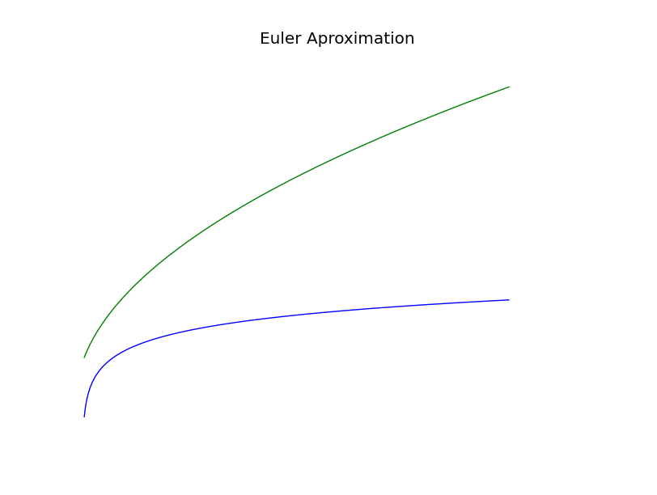

#Numerics

###About:
A collection of Numerical Analysis Methods

##Randomness

Random numbers

##Root Finding

Find root x : f(x) = 0

##Integrate 

Finds area under f(x)

##Differentials 

Find f(x) : y' = f'(x) and f(x) = a