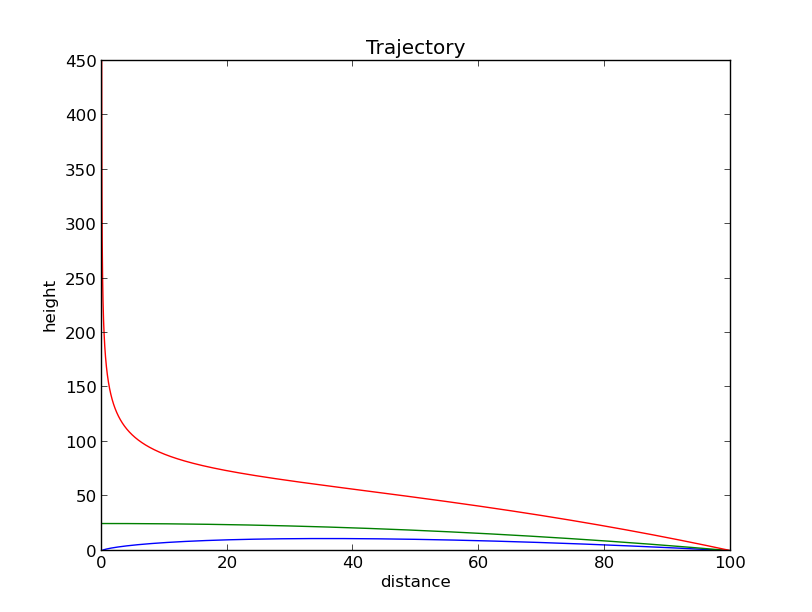

Differential Equations:
-----------------------


Euler's Method:
-------------


Approximate curve by moving small steps tangential to the initial value.

```
y' = [y(t+h) - y(t)] / h
y(t+h) = y(t) + h * y'
```

Heun's Method:
--------------


Runge-Kutta:
------------

A more generalized form of Euler's Method for solving differential equations.


Ballistics:
-----------------


`dv/dt = g + (a/m)*v`

Calculate the total time the bullet is in the air.

Results:

| direction   |      time          |      velocity        |
|-------------|--------------------|----------------------|
| up          | 14.013             | 0.00141630056777     |
| down        | 14.014             |  -299.97252056       |


Stock Market:
-------------


```
x' = (a)x + (b)xy
y' = (c)y + (e)xy
```

Modeling competition between stock prices.

Results:

| stock       |      time          |      value           |    y>=x            |
|-------------|--------------------|----------------------|--------------------|
| x           |         4          | 77.8889199659        | 112.86717730768805 |
| y           |         4          | 479.212120381        | 112.86559624322435 |


Flight Path:
------------

Landing a plane at an airport based on initial value conditions.

`y' = y/x - w/v*sqrt(1 + (x/y)^2)`

Euler Method:



