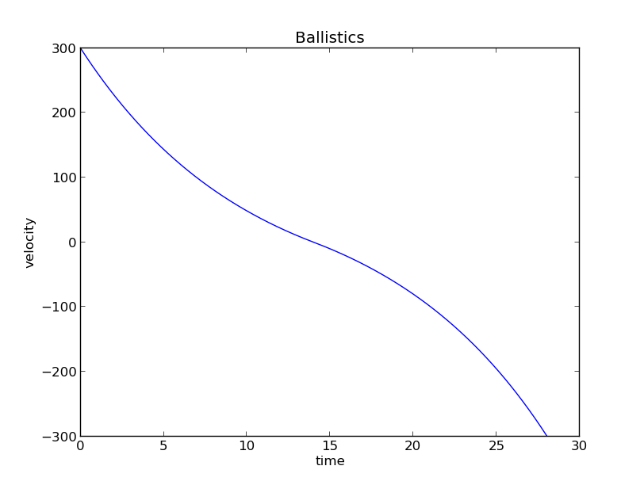

Differential Equations:
-----------------------


Euler Method:
-------------

```
y' = [y(t+h) - y(t)] / h
y(t+h) = y(t) + h * y'
```

Approximate curve by moving small steps tangential to the initial value.


Ballistics Problem:
-----------------

 

`dv/dt = g + a/m*v`

Problem: Calculate the total time the bullet is in the air.

Results:

| direction   |      time          |      velocity        |
|-------------|--------------------|----------------------|
| up          | 14.013             | 0.00141630056777     |
| down        | 14.014             |  -299.97252056       |


Stock Market:
-------------


Modeling competition between stock prices. 

Results:

| stock       |      time          |      value           |
|-------------|--------------------|----------------------|
| x           |         4          | 77.8889199659        |
| y           |         4          | 479.212120381        |


y>=x: (112.86559624322435, 112.86717730768805)