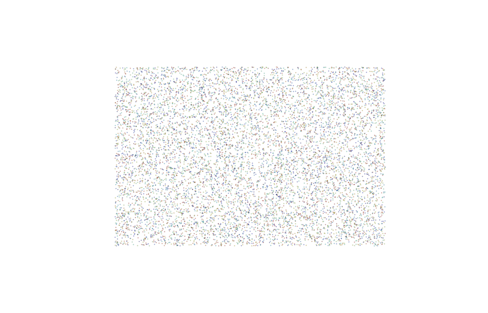
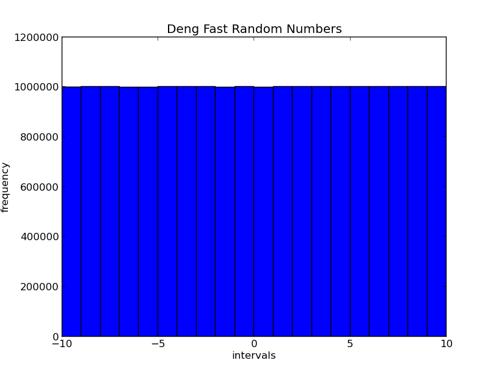
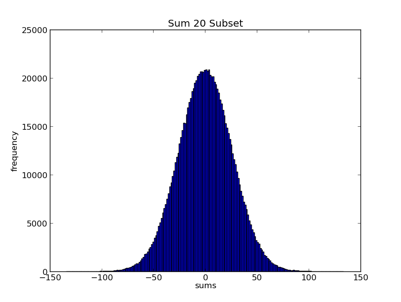
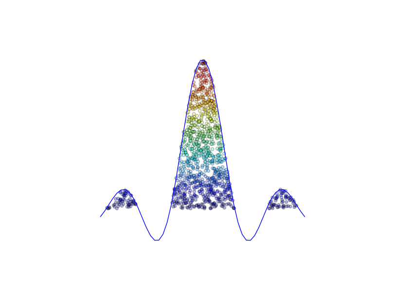

Integration:
------------

Random Numbers:
--------------

Deng Fast Random Numbers:

`n = (n-1 + n-2) mod 1`

Generates random numbers based on the remainder between two seeds. How fast is that? That's [Deng](http://en.wikipedia.org/wiki/Yuefan_Deng) fast!

Testing Randomness :

What does it mean to be random? The answer is relative to your information. The weather may seem like a random event, but when more information is known the predictability of the event becomes more likely. Atmospheric noise is at the end of the random spectrum because there is an information set the size of the universe to account for!

 Randomness is not a well defined concept. The only way to judge randomness is through a relative comparison of numbers based on statistical analysis. Below are some statistical tests performed on the [Deng](http://www.ams.sunysb.edu/~deng/) fast random number generator. 

Distribution Test:

A test for uniformity by counting the number of each random number falls inside of an interval.

Summation Test:

The number of random numbers sum from a subset of the total list of generated random numbers.

Integration:
------------

Quadrature: 

The trapezoidal method partitions the space under the curve into little trapezoids and sums the area for each to generate the total area under the curve. 

Monte Carlo:

`n/N = a/A`

Monte Carlo integration uses randomness to chose the positions within the space. The big idea here is that the number of points selected under the curve in proportion to the total selected points converges to the area under the curve proportional to total area.  
 

Results:

| Method      |      iterations    |      area            | % error | 
|-------------|--------------------|----------------------|---------|
| Quadrature  | 0.204081632653     | 22101.8582419        | 0.0035  | 
| Monte Carlo | 10000              | 1.6004               | 0.0325  |