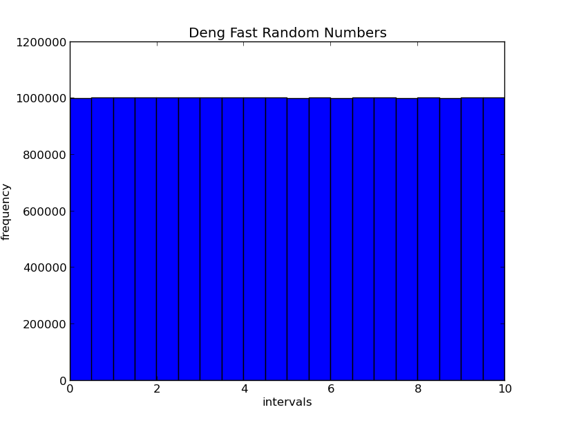

Integration:
------------

Random Number:
--------------

Deng Fast:

`n = (n-1 + n-2) mod 1`

Generates random numbers based on the remainder of the initial value of two seeds. 

Distribution:

That's Deng fast! Inspired by professor [Deng](http://en.wikipedia.org/wiki/Yuefan_Deng).

Integration:
------------

Quadrature: 
The trapezoidal method partitions the space under the curve into little trapezoids and sums the area for each to generate the total area under the curve. 

Monte Carlo:
The Monte Carlo uses random numbers to chose the positions within the space. The relation between the area under the curve is `n/N = a/A`

Results:

| Method      |      time          |      area            |
|-------------|--------------------|----------------------|
| Quadrature  | 14.844221105527637 | 0.080136379072063391 |
| Monte Carlo | 14.844221105527637 | 0.080136379072063391 |