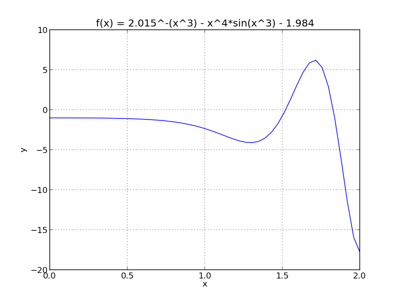

###Finding Roots

####Bisection Method:
The initial interval is partitioned into two intervals (midpoint = interval/2). Depending on the location of the root, either the right or left side of the partitioned interval is chosen to be the new interval. The process is iterated until the tolerance for f(x) is met. The bisection method coverages slowly at a rate of 1/2, but the method has the advantage of guaranteeing correctness on non smooth and ill behaved functions.

####Newton Method:


A value is chosen close to the root, then a closer value to the root is calculated moving towards the root by the ratio of the function and its derivative evaluated at the initial value. Newton method converges quickly at a rate of , but falls short on non smooth functions, looping, and divergence intervals.   


#####Method Comparison:
|        |Bisection| Newton|
|--------|---------|-------|
| speed  | slow    | fast  |
| converge| always | sometimes|

####Example:



By inspection of the graph, the root of the function is approximately at the location x = 1.55.

####Results:
#####Bisection Method:
interval containing root = [1.5,1.6]
iterations = 8
root = 1.5191

#####Newton Method:
start point = 1.6
iterations = 3
root = 1.5191

#####Run:
```
python example.py
```